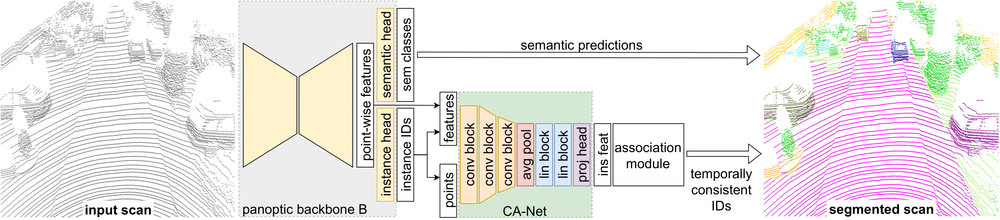

# Contrastive Instance Association for 4D Panoptic Segmentation using Sequences of 3D LiDAR Scans



This repository contains the implementation of the paper [Contrastive Instance Association for 4D Panoptic Segmentation using Sequences of 3D LiDAR Scans](https://www.ipb.uni-bonn.de/wp-content/papercite-data/pdf/marcuzzi2022ral.pdf).

The approach builds on top of an arbitrary single-scan Panoptic Segmentation network and extends it to the temporal domain by associating instances across time using our Contrastive Aggregation network that leverages the point-wise features from the panoptic network.

# Requirements

* Install this package: go to the root directory of this repo and run:
```
pip3 install -U -e .
```
* Install packages in [requirements.txt](requirements.txt).

* Install [MinkowskiEngine](https://nvidia.github.io/MinkowskiEngine/overview.html#installation).

* Install [spconv version 1.2.1](https://github.com/traveller59/spconv/tree/fad3000249d27ca918f2655ff73c41f39b0f3127).

# Data preparation
Download the [SemanticKITTI](http://www.semantic-kitti.org/dataset.html#overview) dataset inside the directory `data/kitti/`. The directory structure should look like this:
```
./
└── data/
    └── kitti
        └── sequences
            ├── 00/           
            │   ├── velodyne/	
            |   |	├── 000000.bin
            |   |	├── 000001.bin
            |   |	└── ...
            │   └── labels/ 
            |       ├── 000000.label
            |       ├── 000001.label
            |       └── ...
            ├── 08/ # for validation
            ├── 11/ # 11-21 for testing
            └── 21/
                └── ...
```

# Pretrained models
* Pretrained [Panoptic Segmentation model](https://www.ipb.uni-bonn.de/html/projects/contrastive_instance_association/panoptic_pq_564.pth).

* Pretrained [Contrastive Aggregation model](https://www.ipb.uni-bonn.de/html/projects/contrastive_instance_association/aggregation_aq_724.ckpt).

# Reproducing the results
Run the evaluation script, which will compute the metrics for the validation set:

```
python evaluate_4dpanoptic.py --ckpt_ps path/to/panoptic_weights --ckpt_ag path/to/aggregation_weights 
```
# Training
## Create instances dataset 
Since we use a frozen Panoptic Segmentation Network, to avoid running the forward pass during training, we save the instance predictions and the point features in advance running:

```
python save_panoptic_features.py --ckpt path/to/panoptic_weights
```

This will create a directory in `cont_assoc/data/instance_features` with the same structure as Kitti but containing, for each sequence of the train set, `npy` files containing the instance points, labels and features for each scan. 

## Save validation predictions
To get the 4D Panoptic Segmentation performance for the validation step during training, we save the full predictions for the validation set (sequence 08) running:

```
python save_panoptic_features.py --ckpt path/to/panoptic_weights --save_val_pred
```

This will create a directory in `cont_assoc/data/validation_predictions` with `npy` files for each scan of the validation sequence containing the semantic and instance predictions for each point. 

## Train Contrastive Aggregation Network

Once the instance dataset and the validation predictions are generated, we're ready to train the Contrastive Aggregation Network running:

```
python train_aggregation.py 
```
All the configurations are in the `config/contrastive_instances.yaml` file.

# Citation

If you use this repo, please cite as :

```
@article{marcuzzi2022ral,
  author = {Rodrigo Marcuzzi and Lucas Nunes and Louis Wiesmann and Ignacio Vizzo and Jens Behley and Cyrill Stachniss},
  title = {{Contrastive Instance Association for 4D Panoptic Segmentation \\ using Sequences of 3D LiDAR Scans}},
  journal = {IEEE Robotics and Automation Letters (RA-L)},
  year = 2022,
  volume={7},
  number={2},
  pages={1550-1557},
}

```

# Acknowledgments

The Panoptic Segmentation Network used in this repo is [DS-Net](https://github.com/hongfz16/DS-Net).

The loss function it's a modified version of [SupContrast](https://github.com/HobbitLong/SupContrast).

# License
Copyright 2022, Rodrigo Marcuzzi, Cyrill Stachniss, Photogrammetry and Robotics Lab, University of Bonn.

This project is free software made available under the MIT License. For details see the LICENSE file.
